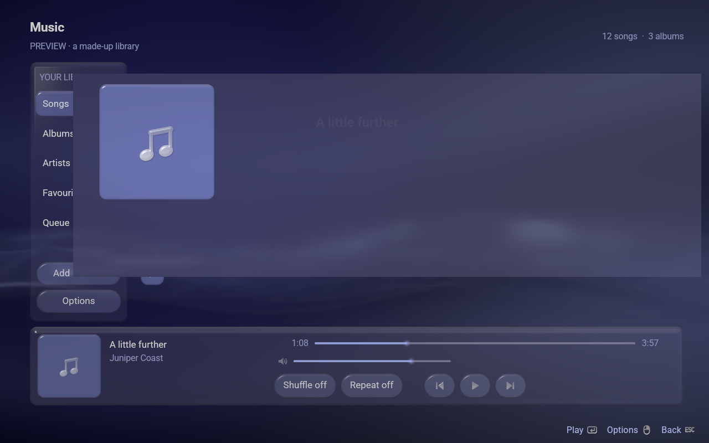
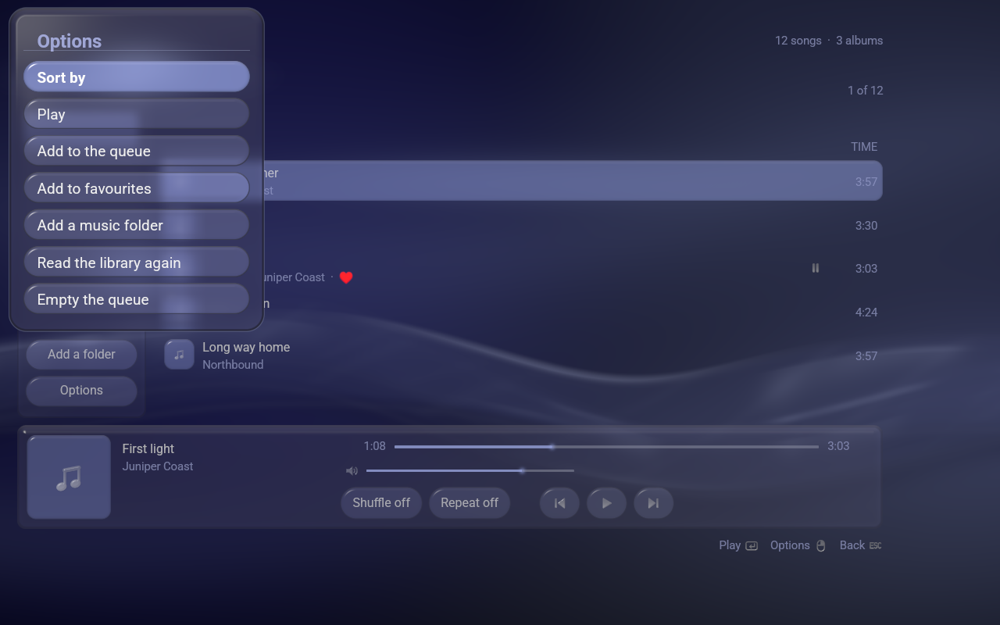
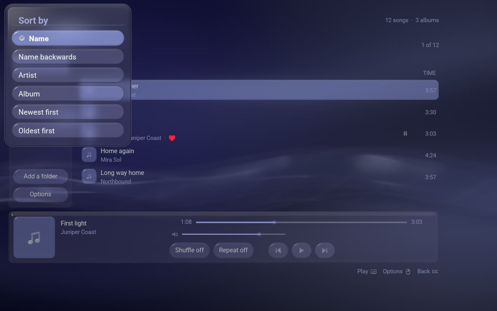

# Songonsole

**A music library and player for [LineXinBar](https://github.com/Petexy/LineXinBar),
driven by a controller. It is shown as *Music*.**

`songonsole` is the project, the package and the command; **Music** is what it
is called on the desktop entry, in the menu and on the window — the same split
[Videonsole](https://github.com/Petexy/videonsole) has, which ships as
`videonsole` and is shown as Videos.

Built on [lxb-toolkit](https://github.com/Petexy/lxb-toolkit): the shell's own
colours, glass, motion, type and marks, so a music library sits beside the
shell rather than in front of it. It is an ordinary Wayland application and
runs under GNOME or Plasma as readily as under the shell it was made for; there
it has no tile of its own, because it is what the **Music** shelf opens — the
same way Pictures is reached from Images and Videos from Video.


[](LICENSE)
[](VERSION)
[](Cargo.toml)

---

## What it is

```sh
songonsole                      # the folders you have added
songonsole ~/Music              # that folder as well, from now on
songonsole ~/Music/first.flac   # that song, playing, and the folder it is in
```

Your songs, gathered from the folders you name, read for their tags and their
artwork, and laid out five ways: **Songs**, **Albums** as a wall of record
sleeves, **Artists**, **Favourites** and the **Queue**. A record with no sleeve
of its own wears the same mark this application does, at whatever size it is
drawn.

**Only the thing under the light is drawn as something to press.** A list in
which every row is a button, or a wall in which every record is, has nothing
picked out — and it leaves the one that *is* chosen with nothing more to say
for itself than a change of tint. The song that is playing is *marked* rather
than tinted: it wears the transport's own play or pause mark, which says one
thing more than a colour could, namely whether it is running or standing
still.


**The row along the bottom is both what is playing and how to play it**: the
sleeve, the song, the artist, the two bars — how far through it is, and how
loud — and the five controls. It is on the screen on every page, so the music
is never more than one press away from wherever you happen to be.

## Playing one

**A song opens out of the row it was pressed on.** The sleeve on that row grows
until it fills the window, and what it grows into is the Now Playing page: the
artwork as large as the screen will allow, the song, the artist, the album it
came from, whether shuffle and repeat are on, where it has got to, and what is
coming after it. Back shrinks that page back into the row it came from. A folder opened on an album
is the same movement at the size of a card, and the music keeps playing while
you go on browsing.



One number drives the whole of that crossing — where the page is, how far the
page behind has stepped back and faded, and how solid the words underneath are
cut — so that all of them land on the same frame. Two clocks would land the
sleeve and its own chrome separately, which is what a spring beside an ease
always does.


## The controls

The whole point of the design language is that a controller, a keyboard and a
pointer are one interface rather than three. Nothing here is a controller
*mode*.

**One model, and it is the screen.** The rail and the browser stand side by
side, with the strip across the foot of both:

```
  rail │ browser
 ──────┴─────────
       strip
```

Up and down walk a zone's rows, left and right its columns, and falling off an
edge hands the light to the zone that is really there — the strip is *under*
the browser, so down reaches it and right does not. What it lands on is the row
nearest where it came from: the top of the strip coming down, and whatever
handed the light over going back up. Never the row the light happened to be on
the last time it was there, which is a down that lands somewhere different
every time it is pressed.

The rail is **seven rows** — the five shelves, then Add a folder, then Options
— and standing on either button does not change which shelf is open. The strip
is **four**: the record, the position bar, the loudness bar, and the row of
buttons.

| | A pad | A keyboard, a mouse |
|---|---|---|
| move | D-pad, left stick | arrows |
| on a bar, **move the bar** | D-pad left/right | arrows left/right, or drag it |
| on a bar, **by how much** | **the left stick** | — |
| play what is under the light, or open the album it is on | **A** | Enter, Space |
| back, and **close** at the rail | **B** | Escape, Backspace |
| the Options menu | **Y** | F10, Menu, right-click |
| the next and previous shelf | **RB** / **LB** | Tab / Shift-Tab |
| play or pause, wherever you are | **Start** | — |

The Now Playing page is the same model laid out the other way round — the
up-next list stands above the strip rather than beside it — so down off the end
of the queue is the strip, and up off the top of the strip is the queue. Left
out of the queue is the strip as well, because a queue can run to hundreds and
pressing down through all of them to reach Play is not a way out.

**A bar is a control, not a picture.** The light stands on the whole row, left
and right move the handle along it, and a pointer landing anywhere on it says a
place outright and goes on saying it while the button is held. Up and down are
what get on and off a bar, because left and right are spoken for while the
light is on one — the same shape the Settings column has, where a row is
reached down the column and moved across it. **A** does the obvious thing to
whatever you are standing on: play or pause on the one bar, mute or unmute on
the other.

**The stick moves a bar by how far it is pushed.** A direction is a thing that
happened; a bar wants a quantity, and the toolkit answers in actions because
that is what makes a pad, a keyboard and a wheel one interface instead of
three. So this reads the stick itself for exactly this one purpose — as the
film player reads its triggers and the photo viewer its own — and the number
drives a speed rather than a step: a thumb just off centre creeps along the
song, and a thumb at the stop crosses it. Squared on the way in, so the useful
half of the travel is the slow half. Everywhere but on a bar the stick stays
the toolkit's own way of walking a list, untouched.

**The record at the head of the strip is the way back to what is playing.**
Stand on it and press **A**, or click it, and the Now Playing page grows out of
the sleeve. On a machine with a controller and no mouse there has to be a way
back that is not a click.

**The transport is the same eight things on both screens**, in the same order:
the record that says what is playing, the bar that says how far through the
song it is, the bar that says how loud, then shuffle and repeat, then the three
that move through the music. Drawing two transports is how two transports come
to disagree about what the middle button says. The Now Playing page has no
record row of its own — it is what that row opens — so the walk starts on the
position bar there.

Three of the five buttons are **marks** — the same `media-previous`,
`media-play`, `media-pause` and `media-next` the shell's own media card draws,
so pressing Play here and pressing Play in the guide are plainly the same act.
Shuffle and repeat are not pictured, because the design language has no shuffle
mark and no repeat mark and the nearest neighbours are both something else:
`sort` is a sorting order and `refresh` is reading a folder again. A word is
better than the wrong mark, which is the rule the button legend keeps about
Start.

A pointer works everywhere, the wheel scrolls the library, and the row of
button hints in the corner is clickable — which is how a mouse gets back out of
a page whose Back is only ever drawn there. That row names Start only while a
pad is in hand, because no key on a keyboard pictures it.

## If the controller does nothing

```sh
songonsole --controllers
```

There are two completely different reasons a pad can appear to be ignored, and
from the outside they look identical: the application not reading it, or there
being no gamepad on the machine to read. That flag says which.

The second is more common than it sounds. **A controller whose driver is not in
the kernel presents no gamepad at all** — a Steam Controller run outside the
session shell that drives it appears as a mouse and a keyboard and nothing
else, so there is nothing there for this or any other program to read. Under
LineXinBar the shell is that driver and the pad is there; on a plain desktop,
with neither the shell nor Steam running, `ls /dev/input/js*` finds nothing.

## What else it does

- **Six sort orders** — Name, Name backwards, Artist, Album, Newest first,
  Oldest first — behind one row of the Options menu, with the one in force
  ticked. The light stays on the song you were looking at while the listing
  rearranges itself around it, so a change of order reads as the same songs in
  a different order rather than as a different listing. Unlike the film player
  and the photo viewer, which are opened on a folder somebody chose, this is
  opened on a library that is always the same — so the order is remembered
  between runs.
- **Two shelves keep an order of their own** and are not offered one: the
  **queue**, which is the order it is going to play in, and an **album**, which
  is disc and track number. A menu naming something that would do nothing is
  worse than a menu that does not name it.
- **The queue names occurrences, not songs.** A song added twice is two rows
  that can be taken out separately. Shuffle visits each occurrence once, and
  Previous retraces what was actually played rather than walking backwards
  through a list nothing played in that order — and restarts the current song
  once it is more than three seconds in, which is what every transport in the
  world does.
- **Nothing in the Options menu closes Music.** Back does, from the rail,
  exactly as it closes Videos and Pictures — which is what the corner of the
  screen has always said it would.
- **Somewhere else to look**: *Add a music folder* puts the question to this
  desktop's own file chooser through the portal, exactly as Pictures and Videos
  do. On LineXinBar that is the shell's own chooser; `LXB_FILE_PORTAL=0` asks
  for the toolkit's built-in one outright.
- **It fits the window it is given**, from 640×400 up. The row of five gives up
  room evenly rather than letting one group walk over another, and the position
  bar gives up the song's *length* before it gives up its groove — the length
  is on the song's own row in the listing as well, and the groove is the only
  place the position is.





## What it reads, and what it plays

Title, artist, album artist, album, disc, track number and length come from
`ffprobe`. Artwork comes from `cover.jpg`, `cover.png`, `folder.jpg`,
`folder.png`, `front.jpg`, `Cover.jpg` or `Folder.jpg` beside the music, and
failing that from inside the file itself, lifted out with `ffmpeg` and kept in
`$XDG_CACHE_HOME/songonsole/covers` so it is only ever read once.

MP3, FLAC, AAC, M4A and M4B (ALAC included), Ogg Vorbis, WAV, AIFF and MKA
play. **Opus, WMA, APE, WavPack and Musepack do not**, because Symphonia does
not decode them — the shell's Music shelf knows those extensions and this does
not list them, since a library holding a song that will not play is worse than
one that leaves it out. Each of the twelve on the list was settled by encoding
a file and pulling samples back out of the decoder, rather than by reading a
feature table.

The walk is recursive, deduplicates overlapping roots, and does not follow
directory symlinks — a folder that contains itself is a walk that does not end.
Your music files are read and never written. Folders, favourites, volume,
shuffle, repeat and the order live in
`$XDG_CONFIG_HOME/songonsole/settings.json`, written to a temporary file and
renamed over the old one.

## How it is built

About five and a half thousand lines over the toolkit, and fourteen hundred
more of tests.

```text
src/main.rs       the window, the arguments, and --shot
src/app.rs        what is being listened to, and what every control does to it
src/draw.rs       putting it on the screen
src/playing.rs    the Now Playing page
src/library.rs    what is in a folder, what its tags say, and in what order
src/queue.rs      what is going to play, shuffled or not
src/audio.rs      the sound worker: one device, one file, one seek at a time
src/settings.rs   what is remembered between runs
src/legend.rs     what the buttons do, drawn rather than spelled out
src/pad.rs        how far the stick is pushed, and nothing else
src/i18n.rs       the ten catalogs, and the one the session speaks
```

Three things are worth knowing before reading it.

**It does not draw its own window**, which both of its siblings do, and the
reason is a number: `Ui::picture` reads a file into a 512-pixel cell of a
shared atlas — short for a photograph filling a 4K screen, and ample for a
record sleeve. Nothing here needs a pass of its own, so `lxb-app` owns the
window, the frame loop, the controls and the sounds, this calls one page
function per frame, and every page can be drawn over by a menu, a dialog and
the file question.

**Everything that moves is a function of the scene clock** and of when it
began; nothing is accumulated frame by frame. That is not tidiness. `--shot`
draws two frames at one instant, so a `dt` of nought would freeze every
animation at whatever it happened to be, and a picture of an animation would be
a picture of nothing. An animation that knows when it began can be asked what
it looks like at any moment — which is also what `--after` is. The one
exception is a bar somebody is moving, which is a rate and has to accumulate;
it is kept in one place and let go of when the hand comes off.

**Scanning and sound each have a worker.** Twenty thousand songs is twenty
thousand `ffprobe` runs and none of them may hold up a frame; opening a device,
a file or a seek may not interrupt a press either. Reports from the sound
worker carry a generation, so a late end-of-track event from the song before
cannot advance the queue past the one that just started.

`pad.rs` is the one place this goes past `lxb-input`, and only for the stick.
An action is a thing that happened and a stick is a quantity, and there is no
honest way to say "a third of the way over" in a list of actions. It maps
nothing, decides no cadence and has no opinion about any button:
`lxb_toolkit::input` stays the only thing here that decides what a control
*means*.

## Build

Rust 1.87 or newer, and the **lxb-toolkit development component** installed —
`Cargo.toml` names its crate sources at `/usr/share/lxb-toolkit/crates`, which
is where every distribution here puts them. Cargo compiles those sources into
this binary, so what comes out links no `liblxb_*.so` at all.

Beside that: `alsa-lib` and its development files, which the sound library
links outright, and `ffmpeg` at run time for `ffprobe` and `ffmpeg` themselves.

```sh
cargo build --release --locked
cargo run --release -- ~/Music
```

## Verify

```sh
cargo test --locked
cargo clippy --all-targets --locked -- -D warnings
cargo fmt --check
```

and the one worth knowing about:

```sh
songonsole --demo --shot page.png --size 960x600
```

`--demo` is a made-up library, plainly labelled as one, with no audio behind it
and nothing of yours touched — it never writes a setting. `--shot` writes one
settled frame to a PNG **with no display at all**, through the same renderer
the window uses; every animation is put where it is going first, so what it
photographs is the page at rest. It takes
`--view songs|albums|artists|favourites|queue` and `--playing`.

`--after SECONDS` is the exception, and the only way to photograph an
*animation*: the page is settled first, then pressed, and the picture is taken
exactly that long afterwards. `--back` presses Back rather than opening, so the
way out can be photographed too.

```sh
songonsole --demo --shot opening.png --playing --after 0.16
LC_ALL=zh_CN.UTF-8 songonsole --demo --shot page.png
```

[`docs/verification.md`](docs/verification.md) says what has actually been run
against this, and — as plainly — what has not.

## Install

```sh
make install PREFIX="$HOME/.local"
```

or a real package:

```sh
./packaging/build.sh arch      # | debian | fedora | nix
./packaging/build.sh check     # what a package would have to agree with
```

`~/.local/bin` has to be on `PATH` for a user-local install. The executable,
the window class, the desktop entry, the icon and the AppStream id are all
`songonsole`; only what a person reads says *Music*, and that is translated.
See [`packaging/README.md`](packaging/README.md).

## Languages

Ten, compiled in, with the faces they are written in: German, English (UK),
English (US), Spanish, French, Hindi, Polish, Brazilian Portuguese, Russian and
Simplified Chinese — in whichever one the session speaks, which on LineXinBar
is the one Settings > Language names. See
[localization](docs/localization.md).

## What it deliberately does not do

No streaming service, no saved playlists, no gapless playback or crossfade, and
no MPRIS service — so the media keys and the shell's own media card do not see
it yet. The queue is this session's. All of those are absences rather than
oversights, and each is a decision to be taken rather than a gap to be filled
quietly.

## Licence

[GPL-3.0-only](LICENSE), matching LineXinBar and the toolkit. It releases under
the same version as LineXinBar, lxb-toolkit, Imagonsole, Videonsole,
DistriBumpy and CEDM.
