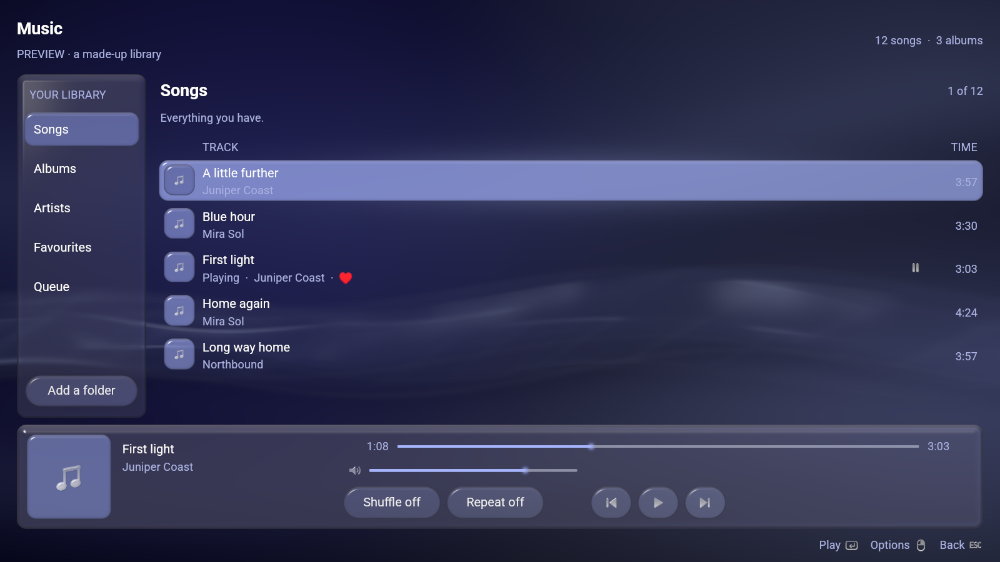
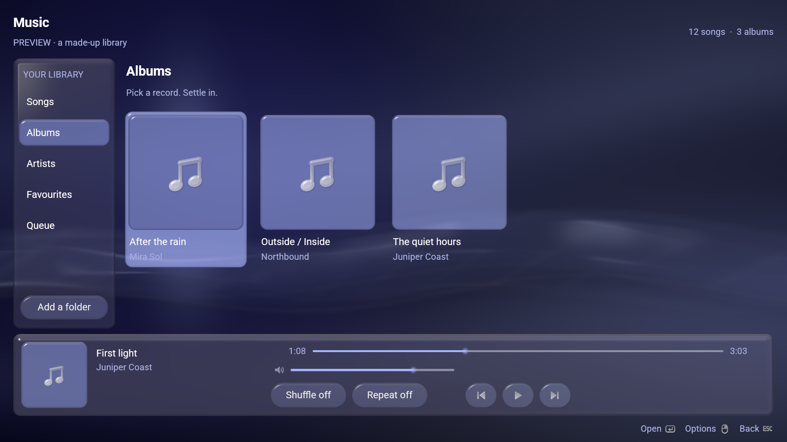
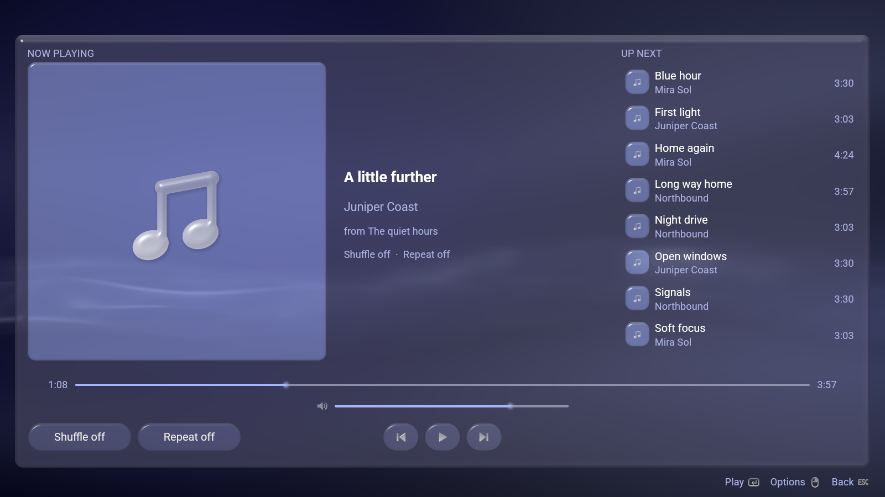
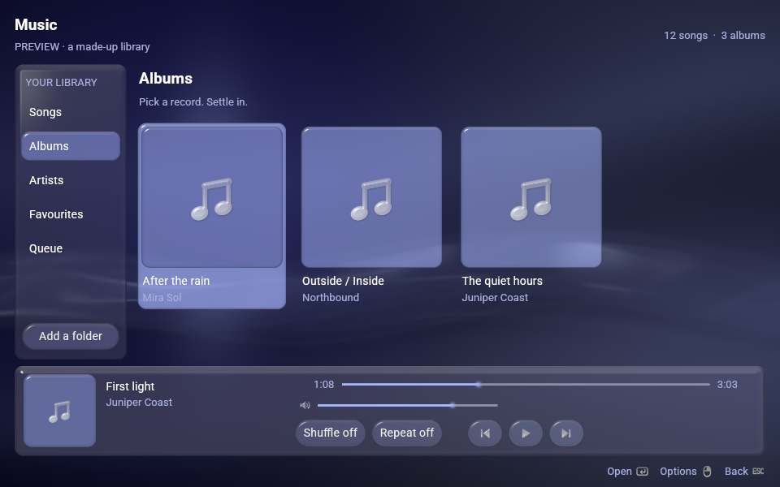

# Songonsole

**A music library and player for [LineXinBar](https://github.com/Petexy/LineXinBar),
driven by a controller. It is shown as *Music*.**

[](LICENSE)
[](VERSION)
[](Cargo.toml)



`songonsole` is the project, the package and the command; **Music** is what it
is called on the desktop entry, in the menu and on the window. It is built on
[lxb-toolkit](https://github.com/Petexy/lxb-toolkit) — the shell's own colours,
glass, motion, type and marks — and it is an ordinary Wayland application, so
it runs under GNOME or Plasma as readily as under the shell it was made for.
There it has no tile of its own, because it is what the **Music** shelf opens.

Its siblings are [Videonsole](https://github.com/Petexy/videonsole) (Videos),
[Imagonsole](https://github.com/Petexy/imagonsole) (Pictures) and
[DistriBumpy](https://github.com/Petexy/distribumpy) (Software Hub).

## Use

```sh
songonsole                      # the folders you have added
songonsole ~/Music              # that folder as well, from now on
songonsole ~/Music/first.flac   # that song, playing, and the folder it is in
songonsole --demo               # a made-up library; nothing of yours is touched
```

Your songs, gathered from the folders you name, read for their tags and their
artwork, and laid out five ways: **Songs**, **Albums** as a wall of record
sleeves, **Artists**, **Favourites** and the **Queue**. A record with no sleeve
of its own wears the same mark this application does, at whatever size it is
drawn.



## What it does

- **Only the thing under the light is drawn as something to press.** A list in
  which every row is a button has nothing picked out. The song that is playing
  is *marked* rather than tinted: it wears the transport's own play or pause
  mark, which says one thing more than a colour could.
- **The row along the bottom is both what is playing and how to play it** —
  the sleeve, the song, the artist, the two bars and the five controls. It is
  on the screen on every page, so the music is never more than one press away.
- **A song opens out of the row it was pressed on.** The sleeve grows until it
  fills the window, and what it grows into is the Now Playing page. One number
  drives the whole of that crossing, so every part of it lands on the same
  frame.
- **Six sort orders** — Name, Name backwards, Artist, Album, Newest first,
  Oldest first — with the one in force ticked. The light stays on the song you
  were looking at while the listing rearranges itself around it. Unlike its
  siblings, which are opened on a folder somebody chose, this is opened on a
  library that is always the same, so the order is remembered between runs.
- **Two shelves keep an order of their own** and are not offered one: the
  queue, which is the order it is going to play in, and an album, which is disc
  and track number.
- **The queue names occurrences, not songs.** A song added twice is two rows
  that can be taken out separately. Shuffle visits each occurrence once, and
  Previous retraces what was actually played — and restarts the current song
  once it is more than three seconds in.
- **Somewhere else to look**: *Add a music folder* puts the question to this
  desktop's own file chooser through the portal. `LXB_FILE_PORTAL=0` asks for
  the toolkit's built-in one outright.
- **It fits the window it is given**, from 640×400 up. The position bar gives
  up the song's *length* before it gives up its groove.



### What it reads, and what it plays

Title, artist, album artist, album, disc, track number and length come from
`ffprobe`. Artwork comes from `cover.jpg`, `folder.jpg`, `front.jpg` and their
neighbours beside the music, and failing that from inside the file itself,
lifted out with `ffmpeg` and kept in `$XDG_CACHE_HOME/songonsole/covers`.

MP3, FLAC, AAC, M4A and M4B (ALAC included), Ogg Vorbis, WAV, AIFF and MKA
play. **Opus, WMA, APE, WavPack and Musepack do not**, because Symphonia does
not decode them — so this does not list them, since a library holding a song
that will not play is worse than one that leaves it out. Each of the nine was
settled by encoding a file and pulling samples back out of the decoder rather
than by reading a feature table.

Your music files are read and never written. Folders, favourites, volume,
shuffle, repeat and the order live in
`$XDG_CONFIG_HOME/songonsole/settings.json`, written to a temporary file and
renamed over the old one.

## Controls

A controller, a keyboard and a pointer are one interface rather than three.
Nothing here is a controller *mode*. The rail and the browser stand side by
side, with the strip across the foot of both:

```
  rail │ browser
 ──────┴─────────
       strip
```

Up and down walk a zone's rows, left and right its columns, and falling off an
edge hands the light to the zone that is really there.

| | A pad | A keyboard, a mouse |
|---|---|---|
| move | D-pad, left stick | arrows |
| on a bar, **move the bar** | D-pad left/right | arrows left/right, or drag it |
| on a bar, **by how much** | **the left stick** | — |
| play what is under the light, or open the album | **A** | Enter, Space |
| back, and **close** at the rail | **B** | Escape, Backspace |
| the Options menu | **Y** | F10, Menu, right-click |
| the next and previous shelf | **RB** / **LB** | Tab / Shift-Tab |
| play or pause, wherever you are | **Start** | — |

**A bar is a control, not a picture.** The light stands on the whole row, left
and right move the handle along it, and up and down are what get on and off it.
**The stick moves a bar by how far it is pushed** — a thumb just off centre
creeps along the song and a thumb at the stop crosses it — which is the one
thing here that reads a control as a quantity rather than as an event.

If a pad seems to be ignored:

```sh
songonsole --controllers
```

A controller whose driver is not in the kernel presents no gamepad at all, and
from the outside that looks exactly like an application that is not reading it.
That flag says which it is.



## Install

Rust 1.87 or newer, and the **lxb-toolkit development component** —
`Cargo.toml` names its crate sources at `/usr/share/lxb-toolkit/crates`, and
cargo compiles them into this binary, so nothing of the toolkit is linked at
run time. Beside that: **alsa-lib** with its development files, which the sound
library links outright, and **ffmpeg** at run time for `ffprobe` and `ffmpeg`
themselves.

```sh
cargo build --release --locked
sudo ./packaging/install.sh --destdir / --prefix /usr
```

`install.sh` places the binary, the desktop entry, the icon and the AppStream
data, and nothing else. For a user-local install instead, with `~/.local/bin`
on `PATH`:

```sh
./packaging/install.sh --destdir / --prefix "$HOME/.local"
```

### As a package

Every recipe calls that same `install.sh`, so a package cannot quietly ship a
different set of files from the line above.

```sh
./packaging/build.sh check     # what a package would have to agree with
./packaging/build.sh arch      # makepkg
./packaging/build.sh debian    # dpkg-deb, on Debian or Ubuntu
./packaging/build.sh fedora    # rpmbuild, on Fedora
./packaging/build.sh nix       # the flake — the one target that does not
                               # need lxb-toolkit installed already
```

Or with Nix and no checkout at all:

```sh
nix run github:Petexy/songonsole
```

See [`packaging/README.md`](packaging/README.md) for why the toolkit is a
*build* dependency and not a runtime one. The executable, the window class, the
desktop entry, the icon and the AppStream id are all `songonsole`; only what a
person reads says *Music*, and that is translated.

## Verify

```sh
cargo test --locked
cargo clippy --all-targets --locked -- -D warnings
cargo fmt --check
```

`--shot` writes one settled frame to a PNG **with no display at all**, through
the same renderer the window uses. Every animation is put where it is going
first, so what it photographs is the page at rest. `--after SECONDS` is the one
way to photograph an *animation*: the page is settled, then pressed, then the
picture is taken that long afterwards.

```sh
songonsole --demo --shot page.png --width 1600 --height 900
songonsole --demo --shot opening.png --width 1600 --height 900 --playing --after 0.16
```

Every picture in this README was taken that way. `--demo` is a made-up library,
plainly labelled as one, with no audio behind it and nothing of yours touched —
it never writes a setting. It takes
`--view songs|albums|artists|favourites|queue` and `--playing`.

[`docs/verification.md`](docs/verification.md) says what has actually been run
against this, and — as plainly — what has not.

## Languages

Ten, compiled in: German, English (UK), English (US), Spanish, French, Hindi,
Polish, Brazilian Portuguese, Russian and Simplified Chinese — in whichever one
the session speaks, which on LineXinBar is the one Settings ▸ Language names.
See [localization](docs/localization.md).

## How it is put together

| | |
|---|---|
| `src/main.rs` | The window, the arguments, and `--shot` |
| `src/app.rs` | What is being listened to, and what every control does to it |
| `src/draw.rs` | Putting it on the screen |
| `src/playing.rs` | The Now Playing page |
| `src/library.rs` | What is in a folder, what its tags say, and in what order |
| `src/queue.rs` | What is going to play, shuffled or not |
| `src/audio.rs` | The sound worker: one device, one file, one seek at a time |
| `src/settings.rs` | What is remembered between runs |
| `src/legend.rs` | What the buttons do, drawn rather than spelled out |
| `src/pad.rs` | How far the stick is pushed, and nothing else |
| `src/i18n.rs` | The ten catalogs, and the one the session speaks |

**[`docs/design.md`](docs/design.md)** is the long answer: why this one does
*not* draw its own window when both of its siblings do, why everything that
moves is a function of the scene clock, and what the two workers are for.

## What it deliberately does not do

No streaming service, no saved playlists, no gapless playback or crossfade, and
no MPRIS service — so the media keys and the shell's own media card do not see
it yet. The queue is this session's. All of those are absences rather than
oversights.

## Licence

[GPL-3.0-only](LICENSE), matching LineXinBar and the toolkit. It releases under
the same version as LineXinBar, lxb-toolkit, Imagonsole, Videonsole,
DistriBumpy and CEDM.
